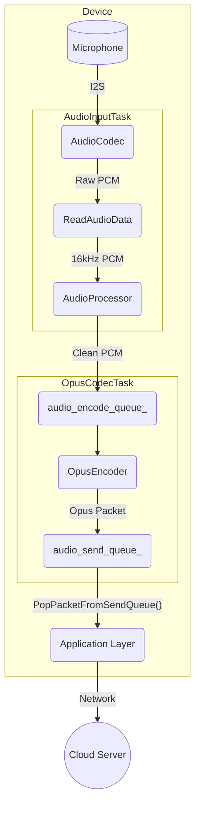
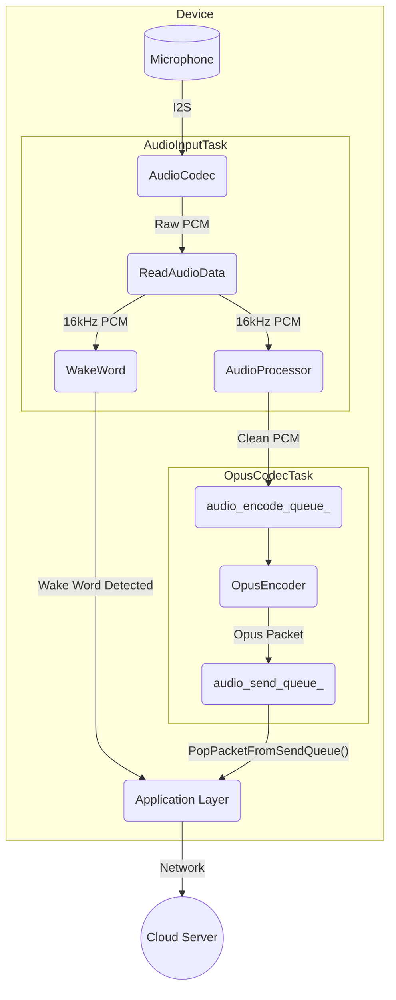
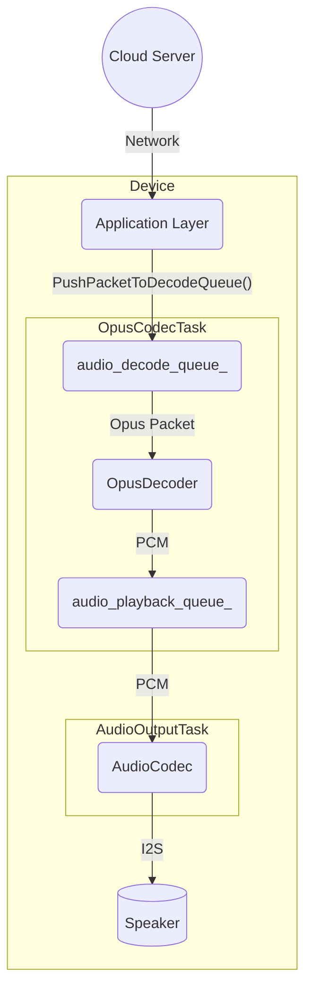

# Audio Service Architecture

The audio service is a core component responsible for managing all audio-related functionalities, including capturing audio from the microphone, processing it, encoding/decoding, and playing back audio through the speaker. It is designed to be modular and efficient, running its main operations in dedicated FreeRTOS tasks to ensure real-time performance.

## Key Components

-   **`AudioService`**: The central orchestrator. It initializes and manages all other audio components, tasks, and data queues.
-   **`AudioCodec`**: A hardware abstraction layer (HAL) for the physical audio codec chip. It handles the raw I2S communication for audio input and output.
-   **`AudioProcessor`**: Performs real-time audio processing on the microphone input stream. This typically includes Acoustic Echo Cancellation (AEC), noise suppression, and Voice Activity Detection (VAD). `AfeAudioProcessor` is the default implementation, utilizing the ESP-ADF Audio Front-End.
-   **`WakeWord`**: Detects keywords (e.g., "你好，小智", "Hi, ESP") from the audio stream. It runs independently from the main audio processor until a wake word is detected.
-   **`OpusEncoderWrapper` / `OpusDecoderWrapper`**: Manages the encoding of PCM audio to the Opus format and decoding Opus packets back to PCM. Opus is used for its high compression and low latency, making it ideal for voice streaming.
-   **`OpusResampler`**: A utility to convert audio streams between different sample rates (e.g., resampling from the codec's native sample rate to the required 16kHz for processing).

## Threading Model

The service operates on three primary tasks to handle the different stages of the audio pipeline concurrently:

1.  **`AudioInputTask`**: Solely responsible for reading raw PCM data from the `AudioCodec`. It then feeds this data to either the `WakeWord` engine or the `AudioProcessor` based on the current state.
2.  **`AudioOutputTask`**: Responsible for playing audio. It retrieves decoded PCM data from the `audio_playback_queue_` and sends it to the `AudioCodec` to be played on the speaker.
3.  **`OpusCodecTask`**: A worker task that handles both encoding and decoding. It fetches raw audio from `audio_encode_queue_`, encodes it into Opus packets, and places them in the `audio_send_queue_`. Concurrently, it fetches Opus packets from `audio_decode_queue_`, decodes them into PCM, and places the result in the `audio_playback_queue_`.

## Data Flow

There are two primary data flows: audio input (uplink) and audio output (downlink).

### 1. Audio Input (Uplink) Flow

This flow captures audio from the microphone, processes it, encodes it, and prepares it for sending to a server.

-   The `AudioInputTask` continuously reads raw PCM data from the `AudioCodec`.
-   This data is fed into an `AudioProcessor` for cleaning (AEC, VAD).
-   The processed PCM data is pushed into the `audio_encode_queue_`.
-   The `OpusCodecTask` picks up the PCM data, encodes it into Opus format, and pushes the resulting packet to the `audio_send_queue_`.
-   The application can then retrieve these Opus packets and send them over the network.

### 1.1 Wake Word Detection Flow

唤醒词检测流程与 uplink 数据流并行进行，音频输入数据会同时送入唤醒词检测模块。检测到唤醒词后，系统会通知上层应用，通常随后启动语音识别（即 uplink 流程）。

-   `AudioInputTask` 读取的音频数据会同时送入 `WakeWord`（唤醒词检测）和 `AudioProcessor`（语音前处理）。
-   检测到唤醒词后，`WakeWord` 通知应用层，通常会启动 uplink 流程（即语音识别和上传）。
-   uplink 的完整数据流为：Mic → Codec → AudioInputTask → AudioProcessor → OpusCodecTask → App → Server。

> **注意：** 经过 AudioProcessor（如 AFE）处理后的音频数据**不会**再用于唤醒词（WakeWord）检测。唤醒词检测通常直接使用从麦克风采集的原始或简单预处理（如降噪、增益）的音频数据，避免因回声消除等处理导致唤醒词识别率下降。因此，WakeWord 检测和 AudioProcessor 处理是并行独立的数据流，二者各自独立处理同一份原始音频输入。

### 2. Audio Output (Downlink) Flow

This flow receives encoded audio data, decodes it, and plays it on the speaker.

-   The application receives Opus packets from the network and pushes them into the `audio_decode_queue_`.
-   The `OpusCodecTask` retrieves these packets, decodes them back into PCM data, and pushes the data to the `audio_playback_queue_`.
-   The `AudioOutputTask` takes the PCM data from the queue and sends it to the `AudioCodec` for playback.

## Power Management

To conserve energy, the audio codec's input (ADC) and output (DAC) channels are automatically disabled after a period of inactivity (`AUDIO_POWER_TIMEOUT_MS`). A timer (`audio_power_timer_`) periodically checks for activity and manages the power state. The channels are automatically re-enabled when new audio needs to be captured or played. 

# AudioService 概览

## 高层概括

`AudioService` 是 ESP32 语音系统的核心音频服务，负责音频数据的采集、处理、编码、解码、播放以及唤醒词检测等功能。它通过多线程和事件机制协调音频输入、输出、处理、编解码等任务，支持多种音频处理器和唤醒词模型，适配不同硬件平台。

## 服务层次关系

- **AudioService**：顶层服务，管理音频流的生命周期、任务调度和事件分发。
  - **AudioCodec**：底层音频编解码器接口，负责与硬件交互，采集和播放PCM数据。
  - **OpusEncoderWrapper / OpusDecoderWrapper**：负责音频数据的Opus编码和解码。
  - **AudioProcessor (AfeAudioProcessor/NoAudioProcessor)**：音频前处理（如VAD、AEC等），可根据配置切换。
  - **WakeWord (AfeWakeWord/CustomWakeWord/EspWakeWord)**：唤醒词检测模块，支持多种模型。
  - **Resampler**：用于不同采样率之间的音频重采样。
  - **AudioDebugger**（可选）：用于音频调试和原始数据分析。

## 数据流

1. **音频输入**
   - 通过 `AudioCodec` 采集原始PCM数据。
   - 若采样率不符，使用 `Resampler` 进行重采样。
   - 数据流向 `AudioProcessor` 进行前处理（如VAD、AEC）。
   - 处理后的数据推入编码队列，准备Opus编码。

2. **音频编码**
   - `OpusEncoderWrapper` 将PCM数据编码为Opus格式。
   - 编码后的数据推入发送队列，供网络传输或本地测试使用。

3. **音频解码与播放**
   - 从接收队列获取Opus音频包，`OpusDecoderWrapper` 解码为PCM。
   - 若输出采样率不符，使用 `Resampler` 进行重采样。
   - PCM数据推入播放队列，由 `AudioCodec` 播放。

4. **唤醒词检测**
   - 音频输入数据可并行送入 `WakeWord` 检测模块。
   - 检测到唤醒词后，触发回调，通知上层应用。

5. **事件与任务调度**
   - 通过FreeRTOS事件组和任务队列，实现多线程并发处理和状态同步。

## 数据流可视化说明

文档中的 `graph TD` 代码块采用 [Mermaid](https://mermaid-js.github.io/mermaid/#/) 语法，目的是实现图形化展示音频服务的数据流和架构关系。  
在 VSCode 中，可以通过安装 [Markdown Preview Mermaid Support](https://marketplace.visualstudio.com/items?itemName=vstirbu.vscode-mermaid-preview) 插件或 [Markdown Preview Enhanced](https://marketplace.visualstudio.com/items?itemName=shd101wyy.markdown-preview-enhanced) 插件来支持 Mermaid 流程图的渲染。  
这样可以在 VSCode 的 Markdown 预览窗口中直接看到图形化的数据流和架构关系。

---
