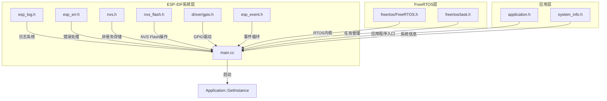
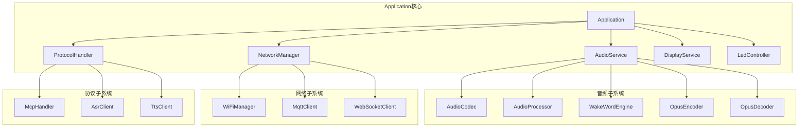
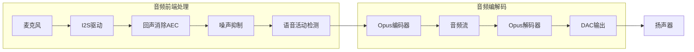
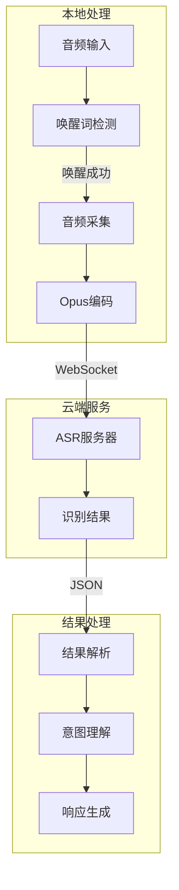
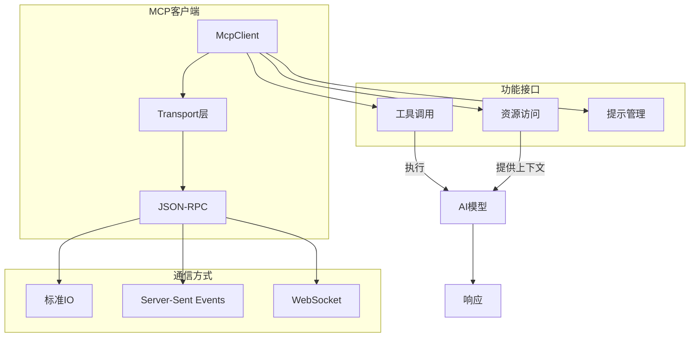
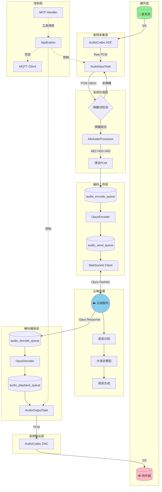
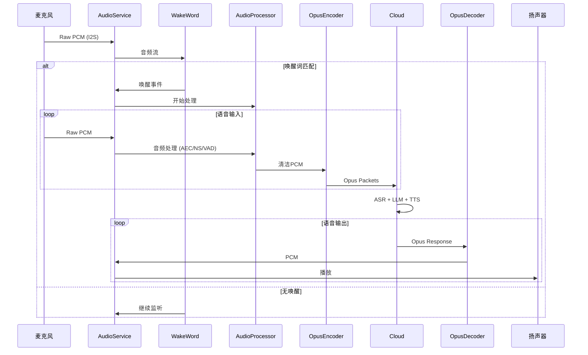
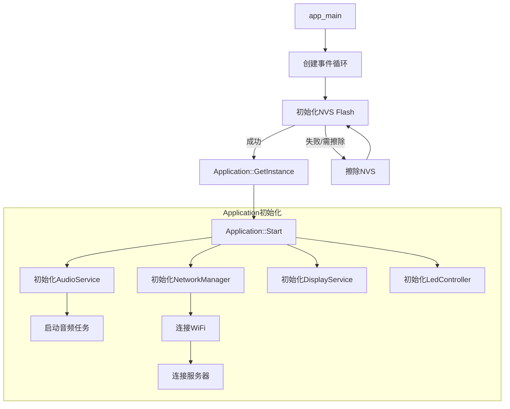

# Xiaozhi-ESP32 主程序架构文档

## 概述

本文档描述了 Xiaozhi-ESP32 项目的主程序入口 `main.cc` 的架构设计，包括头文件依赖关系、核心功能模块以及语音数据流的完整流程。

## 头文件依赖层级

### main.cc Include 层级关系



### Application 模块依赖展开



## 核心功能模块

### 1. 语音处理模块 (Audio Processing)



**主要组件：**
- **AudioCodec**: 硬件抽象层，处理 I2S 通信
- **AudioProcessor (AfeAudioProcessor)**: 基于 ESP-ADF 的音频前端处理
- **WakeWord**: 唤醒词检测引擎
- **OpusEncoderWrapper/OpusDecoderWrapper**: 音频编解码

### 2. 语音识别模块 (ASR - Automatic Speech Recognition)



**工作流程：**
1. 本地唤醒词检测触发语音采集
2. Opus 编码后通过 WebSocket 发送至云端
3. 云端返回识别结果和响应

### 3. MCP (Model Context Protocol) 模块



**MCP 特性：**
- 标准化的 AI 模型交互协议
- 支持工具调用、资源访问和提示管理
- 多种传输方式支持

### 4. MQTT 通信模块

```mermaid
graph TD
    subgraph MQTT客户端
        Client[MqttClient] --> Connect[连接管理]
        Client --> Subscribe[订阅管理]
        Client --> Publish[发布消息]
    end

    subgraph 主题设计
        Subscribe --> Cmd[/device/cmd]
        Subscribe --> Config[/device/config]
        Publish --> Status[/device/status]
        Publish --> Event[/device/event]
    end

    subgraph 消息处理
        Cmd --> Handler[命令处理器]
        Handler --> Action[执行动作]
        Action --> Feedback[状态反馈]
        Feedback --> Status
    end

    Broker[MQTT Broker] <--> Client
```

**MQTT 功能：**
- 设备远程控制
- 状态上报
- 配置下发
- OTA 升级触发

## 语音数据流全局框图

### 完整语音交互流程



### 数据流时序



## 初始化流程



## 电源管理

系统实现了智能电源管理以节省能耗：

- **自动休眠**: 音频编解码器在空闲 `AUDIO_POWER_TIMEOUT_MS` 后自动关闭
- **按需唤醒**: 有新的音频输入/输出需求时自动启用
- **定时器监控**: `audio_power_timer_` 定期检查活动状态

## 文件结构

```
main/
├── main.cc              # 程序入口
├── application.h/cc     # 应用程序主类
├── audio/
│   ├── audio_service.h  # 音频服务
│   ├── audio_codec.h    # 编解码器抽象
│   ├── audio_processor.h # 音频处理器
│   └── opus_*.h         # Opus编解码
├── network/
│   ├── mqtt_client.h    # MQTT客户端
│   └── websocket.h      # WebSocket客户端
├── protocol/
│   ├── mcp_handler.h    # MCP协议处理
│   └── asr_client.h     # ASR客户端
└── display/
    └── display_service.h # 显示服务
```
