# Main Entry Point Architecture

This document describes the architecture of the Xiaozhi-ESP32 project starting from `main.cc`.

## Include Hierarchy

The following diagram illustrates the dependency relationships of the main entry point:


## Application Module Hierarchy


## Key Functional Modules

### 1. Audio Processing (语音处理)

The audio processing module handles real-time audio capture and playback:

| Component | Description |
|-----------|-------------|
| **AudioCodec** | Hardware abstraction layer for I2S communication |
| **AudioProcessor** | AEC (Acoustic Echo Cancellation), noise suppression, VAD |
| **OpusEncoder/Decoder** | High-efficiency audio compression for network streaming |
| **WakeWord** | Keyword detection engine (e.g., "你好小智", "Hi ESP") |

### 2. Speech Recognition (语音识别)

Speech recognition is handled via cloud services:

- Local VAD detects speech activity
- Audio is encoded in Opus format and streamed to cloud
- Cloud ASR returns transcription results
- Results are processed by the application for intent handling

### 3. MCP (Model Context Protocol)

MCP provides tool execution capabilities:

| Feature | Description |
|---------|-------------|
| **Tool Registration** | Dynamic registration of callable tools |
| **Tool Execution** | Execute tools based on AI model requests |
| **Context Management** | Maintain conversation and execution context |

### 4. MQTT Communication

MQTT handles device-cloud messaging:

- Device status reporting
- Remote configuration updates
- Command reception and execution
- OTA update notifications

## Global Voice Data Flow

```mermaid
graph TD
    subgraph Input Pipeline [Input Pipeline - ESP32S3]
        Mic[("🎤 Microphone")] -->|I2S| Codec1[AudioCodec<br/>audio_codec.cc]
        Codec1 -->|Raw PCM| InputTask[AudioInputTask<br/>audio_service.cc]
        InputTask -->|16kHz PCM| WW{WakeWord?}
        
        WW -->|Not Detected| WakeEngine[WakeWord Engine<br/>wake_word.cc]
        WakeEngine -->|Wake Event| App1[Application<br/>application.cc]
        
        WW -->|Detected/Active| Processor[AudioProcessor<br/>afe_audio_processor.cc]
        Processor -->|Clean PCM| EncQueue[Encode Queue<br/>audio_service.cc]
    end

    subgraph Encoding [Encoding - ESP32S3]
        EncQueue --> OpusEnc[Opus Encoder<br/>opus_encoder_wrapper.cc]
        OpusEnc -->|Opus Packets| SendQueue[Send Queue<br/>audio_service.cc]
    end

    subgraph Network [Network Layer]
        SendQueue --> Protocol[Protocol Layer<br/>protocol.cc - ESP32S3]
        Protocol -->|WebSocket| Cloud((☁️ Cloud Server))
        Cloud -->|ASR Result| Protocol
        Cloud -->|TTS Audio| Protocol
        Protocol --> DecQueue[Decode Queue<br/>audio_service.cc - ESP32S3]
    end

    subgraph CloudServices [Cloud Services - 云端]
        Cloud --> ASR[语音识别 ASR]
        ASR --> LLM[大语言模型 LLM]
        LLM --> TTS[语音合成 TTS]
        TTS --> Cloud
    end

    subgraph Decoding [Decoding - ESP32S3]
        DecQueue --> OpusDec[Opus Decoder<br/>opus_decoder_wrapper.cc]
        OpusDec -->|PCM| PlayQueue[Playback Queue<br/>audio_service.cc]
    end

    subgraph Output Pipeline [Output Pipeline - ESP32S3]
        PlayQueue --> OutputTask[AudioOutputTask<br/>audio_service.cc]
        OutputTask --> Codec2[AudioCodec<br/>audio_codec.cc]
        Codec2 -->|I2S| Speaker[("🔊 Speaker")]
    end

    subgraph Application Logic [Application Logic - ESP32S3]
        App1[Application<br/>application.cc] --> StateManager[State Manager<br/>application.cc]
        StateManager -->|Start Listening| InputTask
        StateManager -->|Stop Listening| InputTask
        Cloud -->|Intent/Response| App1
        App1 -->|Execute| MCP[MCP Tools<br/>mcp_server.cc]
    end
```



### Source File Reference Table

| Component | Source File | Location | Description |
|-----------|-------------|----------|-------------|
| **AudioCodec** | `main/audio/audio_codec.cc` | ESP32S3 | I2S hardware abstraction |
| **AudioInputTask** | `main/audio/audio_service.cc` | ESP32S3 | Audio capture task |
| **AudioOutputTask** | `main/audio/audio_service.cc` | ESP32S3 | Audio playback task |
| **AudioProcessor** | `main/audio/afe_audio_processor.cc` | ESP32S3 | AEC, VAD, noise suppression |
| **WakeWord** | `main/audio/wake_word.cc` | ESP32S3 | Keyword detection |
| **OpusEncoder** | `main/audio/opus_encoder_wrapper.cc` | ESP32S3 | PCM to Opus encoding |
| **OpusDecoder** | `main/audio/opus_decoder_wrapper.cc` | ESP32S3 | Opus to PCM decoding |
| **Protocol** | `main/protocols/protocol.cc` | ESP32S3 | WebSocket/MQTT communication |
| **Application** | `main/application.cc` | ESP32S3 | Main application logic |
| **MCP Server** | `main/mcp/mcp_server.cc` | ESP32S3 | Tool execution framework |
| **ASR** | Cloud Service | ☁️ Cloud | Speech-to-text recognition |
| **LLM** | Cloud Service | ☁️ Cloud | Large Language Model inference |
| **TTS** | Cloud Service | ☁️ Cloud | Text-to-speech synthesis |

## Startup Sequence


## Task Priority Model

| Task | Priority | Description |
|------|----------|-------------|
| AudioInputTask | High | Real-time audio capture |
| AudioOutputTask | High | Real-time audio playback |
| OpusCodecTask | Medium-High | Audio encoding/decoding |
| NetworkTask | Medium | Network communication |
| ApplicationTask | Normal | Business logic processing |

## Memory Management

- Audio buffers use pre-allocated ring buffers
- Opus codec uses static memory allocation
- Queue-based inter-task communication prevents memory fragmentation

## State Manager in Application

The Application uses a finite state machine (FSM) to manage device behavior. The state transitions are triggered by events such as wake word detection, user input, network responses, and timeouts.

### State Diagram


### State Transition Flow

```mermaid
graph TD
    subgraph States [Application States - application.cc]
        Idle[🟢 Idle<br/>低功耗待机]
        WWD[🎤 WakeWordDetection<br/>唤醒词检测]
        Listen[👂 Listening<br/>语音采集]
        Process[⚙️ Processing<br/>云端处理中]
        Speak[🔊 Speaking<br/>语音播放]
        OTA[📥 Upgrading<br/>固件升级]
        Config[⚙️ Configuring<br/>配置模式]
    end

    subgraph Events [Trigger Events]
        WakeEvent[Wake Word Event]
        VADStart[VAD Speech Start]
        VADEnd[VAD Speech End]
        TTSReady[TTS Audio Ready]
        TTSDone[TTS Playback Done]
        Timeout[Timeout]
        Button[Button Press]
        OTACmd[OTA Command]
    end

    Idle -->|WakeEvent| WWD
    Idle -->|Button Long Press| Listen
    Idle -->|OTACmd| OTA

    WWD -->|WakeEvent| Listen
    WWD -->|Timeout| Idle

    Listen -->|VADEnd| Process
    Listen -->|Timeout| WWD
    Listen -->|Button| Idle

    Process -->|TTSReady| Speak
    Process -->|Error| Idle
    Process -->|No TTS| Listen

    Speak -->|TTSDone + Continuous| Listen
    Speak -->|TTSDone| WWD
    Speak -->|Button Interrupt| Idle

    OTA -->|Complete/Failed| Idle
    Config -->|Complete| Idle
```



### State Description Table

| State | Chinese Name | Description | Audio Input | Audio Output | Network |
|-------|--------------|-------------|-------------|--------------|---------|
| **Idle** | 空闲待机 | Low power standby, minimal activity | Off | Off | Minimal |
| **WakeWordDetection** | 唤醒词检测 | Listening for wake word only | Active (WakeWord) | Off | Off |
| **Listening** | 语音采集 | Capturing user speech, VAD active | Active (Full) | Off | Streaming |
| **Processing** | 云端处理 | Waiting for ASR/LLM/TTS response | Off | Off | Active |
| **Speaking** | 语音播放 | Playing TTS audio response | Off/Echo Ref | Active | Receiving |
| **Upgrading** | 固件升级 | OTA firmware update in progress | Off | Status Beeps | Active |
| **Configuring** | 配置模式 | WiFi/Device configuration mode | Off | Prompts | AP Mode |

### Event Handler Flow


### Continuous Conversation Mode

```mermaid
sequenceDiagram
    participant User as 用户
    participant App as Application
    participant Audio as AudioService
    participant Cloud as 云端服务

    User->>App: 唤醒词 "你好小智"
    App->>App: State: Idle → Listening
    App->>Audio: StartCapture()
    
    User->>Audio: "今天天气怎么样"
    Audio->>App: VAD Speech End
    App->>App: State: Listening → Processing
    App->>Cloud: Send Audio (Opus)
    
    Cloud->>App: ASR + LLM + TTS
    App->>App: State: Processing → Speaking
    App->>Audio: PlayTTS()
    
    Audio->>App: Playback Complete
    
    alt Continuous Mode Enabled
        App->>App: State: Speaking → Listening
        App->>Audio: StartCapture()
        Note over User,Cloud: 继续对话...
    else Single Query Mode
        App->>App: State: Speaking → WakeWordDetection
        Note over User,Cloud: 等待下次唤醒
    end
```



## MCP (Model Context Protocol) Architecture

MCP enables the AI model to execute local tools on the ESP32S3 device. This section describes how voice commands and custom triggers invoke MCP tools.

### MCP Component Overview


### MCP Tool Discovery by Cloud LLM

MCP工具通过**WebSocket协议**在会话建立时上报给云端LLM，**不是通过MQTT**。


### Tool Schema Upload Flow


### Tool Schema Format (JSON)

每个MCP工具向云端上报以下信息：

```json
{
  "type": "tools_available",
  "tools": [
    {
      "name": "speaker",
      "description": "Control the device speaker volume and mute state",
      "parameters": {
        "type": "object",
        "properties": {
          "action": {
            "type": "string",
            "enum": ["set_volume", "mute", "unmute"],
            "description": "The action to perform"
          },
          "level": {
            "type": "integer",
            "minimum": 0,
            "maximum": 100,
            "description": "Volume level (0-100)"
          }
        },
        "required": ["action"]
      }
    },
    {
      "name": "led",
      "description": "Control the LED color and brightness",
      "parameters": {
        "type": "object",
        "properties": {
          "r": {"type": "integer", "minimum": 0, "maximum": 255},
          "g": {"type": "integer", "minimum": 0, "maximum": 255},
          "b": {"type": "integer", "minimum": 0, "maximum": 255}
        }
      }
    }
  ]
}
```

### Communication Protocol Comparison

| 功能 | WebSocket | MQTT |
|------|-----------|------|
| **工具发现 (Tool Discovery)** | ✅ 使用 | ❌ 不使用 |
| **语音数据流 (Audio Stream)** | ✅ 使用 | ❌ 不使用 |
| **工具调用 (Tool Call)** | ✅ 使用 | ✅ 可选使用 |
| **设备状态上报** | ❌ 不使用 | ✅ 使用 |
| **远程配置更新** | ❌ 不使用 | ✅ 使用 |
| **OTA通知** | ❌ 不使用 | ✅ 使用 |

### How LLM Uses Tool Information


**Example User Query:** "把音量调到50%" (Set volume to 50%)

## Network Communication Protocols

The Xiaozhi-ESP32 uses two primary network protocols for different purposes: **WebSocket** for real-time bidirectional communication and **MQTT** for lightweight pub/sub messaging.

### Protocol Architecture Overview


### WebSocket Protocol

WebSocket provides full-duplex, low-latency communication for real-time audio streaming and AI interaction.

#### WebSocket Characteristics

| Feature | Description |
|---------|-------------|
| **Connection Type** | Persistent, full-duplex TCP connection |
| **Latency** | Very low - suitable for real-time audio |
| **Data Format** | Binary for Opus audio + JSON for control messages |
| **Use Case** | Audio streaming, tool calls, real-time responses |

#### WebSocket Message Flow


#### WebSocket Message Types

| Message Type | Direction | Format | Description |
|--------------|-----------|--------|-------------|
| `audio_data` | ESP32 to Cloud | Binary | Opus-encoded audio frames |
| `tools_available` | ESP32 to Cloud | JSON | Register available MCP tools |
| `asr_result` | Cloud to ESP32 | JSON | Speech recognition result |
| `llm_response` | Cloud to ESP32 | JSON | LLM text response |
| `tts_audio` | Cloud to ESP32 | Binary | TTS audio in Opus format |
| `tool_call` | Cloud to ESP32 | JSON | Request to execute MCP tool |
| `tool_result` | ESP32 to Cloud | JSON | Tool execution result |
| `session_control` | Bidirectional | JSON | Session start stop interrupt |

#### WebSocket Connection States


### MQTT Protocol

MQTT is used for lightweight, reliable messaging for device management, status reporting, and remote control.

#### MQTT Characteristics

| Feature | Description |
|---------|-------------|
| **Connection Type** | Persistent TCP with keep-alive |
| **Pattern** | Publish and Subscribe |
| **QoS Levels** | 0 At most once - 1 At least once - 2 Exactly once |
| **Use Case** | Status reporting, config updates, OTA, remote control |

#### MQTT Topic Structure


| Topic | Direction | QoS | Description |
|-------|-----------|-----|-------------|
| `xiaozhi/{device_id}/status` | ESP32 to Broker | 1 | Device online and offline status |
| `xiaozhi/{device_id}/command` | Broker to ESP32 | 1 | Remote control commands |
| `xiaozhi/{device_id}/config` | Broker to ESP32 | 1 | Configuration updates |
| `xiaozhi/{device_id}/config/response` | ESP32 to Broker | 1 | Config update acknowledgment |
| `xiaozhi/{device_id}/ota` | Broker to ESP32 | 1 | OTA update notifications |
| `xiaozhi/{device_id}/telemetry` | ESP32 to Broker | 0 | Periodic telemetry data |

#### MQTT Message Flow


### WebSocket vs MQTT Comparison


| Aspect | WebSocket | MQTT |
|--------|-----------|------|
| **Primary Use** | Real-time AI interaction | Device management |
| **Data Type** | Audio binary + JSON | JSON only |
| **Latency Requirement** | Critical under 100ms | Tolerant seconds OK |
| **Connection** | During conversation | Always connected |
| **Bandwidth** | High for audio streaming | Low for small messages |
| **Reliability** | Best effort | QoS guaranteed delivery |
| **Offline Handling** | Reconnect and resume | Message queuing |

### Protocol Handler Implementation


### Source Files Reference

| Component | Source File | Description |
|-----------|-------------|-------------|
| **Protocol Handler** | `main/protocols/protocol.cc` | Unified protocol interface |
| **WebSocket Client** | `main/protocols/websocket_client.cc` | WebSocket implementation |
| **MQTT Client** | `main/protocols/mqtt_client.cc` | MQTT implementation |
| **Message Parser** | `main/protocols/message_parser.cc` | JSON message parsing |

### Connection Management


### Error Handling and Reconnection

| Scenario | WebSocket Action | MQTT Action |
|----------|------------------|-------------|
| **Connection Lost** | Exponential backoff reconnect | Auto reconnect with session resume |
| **Auth Failed** | Report error wait for new token | Report error retry with stored credentials |
| **Server Unavailable** | Switch to backup server | Switch to backup broker |
| **Message Send Failed** | Retry with timeout | QoS based retry |
| **Network Change** | Reconnect on new network | Reconnect on new network |

## USB Communication Channel

ESP32-S3 supports USB communication as an alternative or supplement to WiFi-based protocols. USB can provide similar functionality to WebSocket/MQTT for local development, debugging, or offline scenarios.

### USB Communication Options on ESP32-S3

```mermaid
graph TD
    subgraph ESP32S3USB [ESP32-S3 USB Interfaces]
        USBOTG[USB OTG Controller]
        
        subgraph Modes [USB Modes]
            CDC[USB CDC ACM<br/>Virtual Serial Port]
            JTAG[USB JTAG<br/>Debug Interface]
            CustomUSB[Custom USB Device<br/>Vendor Specific]
        end
        
        USBOTG --> CDC
        USBOTG --> JTAG
        USBOTG --> CustomUSB
    end

    subgraph HostPC [Host PC]
        SerialApp[Serial Terminal<br/>or Custom App]
        DebugTool[Debug Tools]
        CustomDriver[Custom USB Driver]
    end

    CDC <-->|Virtual COM| SerialApp
    JTAG <-->|JTAG Protocol| DebugTool
    CustomUSB <-->|Bulk Transfer| CustomDriver
```

### USB vs WiFi Protocol Comparison

| Feature | USB CDC Serial | WebSocket over WiFi | MQTT over WiFi |
|---------|---------------|---------------------|----------------|
| **Connection Type** | Point-to-point wired | Network-based wireless | Network-based wireless |
| **Latency** | Very low < 1ms | Low 10-50ms | Medium 50-200ms |
| **Bandwidth** | High 12Mbps USB 2.0 | Medium depends on WiFi | Low small messages |
| **Range** | Cable length limited | WiFi range | WiFi range |
| **Power** | Can be bus-powered | Requires WiFi radio | Requires WiFi radio |
| **Internet Access** | Requires host bridge | Direct | Direct |
| **Use Case** | Local dev and debug | Cloud AI interaction | Device management |

### USB-based Protocol Implementation

You can implement WebSocket-like or MQTT-like protocols over USB:

```mermaid
flowchart TD
    subgraph USBProtocolStack [USB Protocol Stack - ESP32S3]
        USBDriver[TinyUSB Driver]
        CDCInterface[CDC ACM Interface]
        FrameLayer[Frame Protocol Layer]
        MessageLayer[Message Protocol Layer]
        
        USBDriver --> CDCInterface
        CDCInterface --> FrameLayer
        FrameLayer --> MessageLayer
    end

    subgraph HostProtocolStack [Host Protocol Stack - PC]
        SerialPort[Serial Port Driver]
        HostFrame[Frame Protocol Layer]
        HostMessage[Message Protocol Layer]
        BridgeApp[Bridge Application]
        
        SerialPort --> HostFrame
        HostFrame --> HostMessage
        HostMessage --> BridgeApp
    end

    subgraph CloudConnection [Optional Cloud Bridge]
        LocalWS[Local WebSocket Server]
        CloudWS[Cloud WebSocket]
        LocalMQTT[Local MQTT Broker]
        CloudMQTT[Cloud MQTT Broker]
        
        BridgeApp --> LocalWS
        BridgeApp --> LocalMQTT
        LocalWS --> CloudWS
        LocalMQTT --> CloudMQTT
    end

    MessageLayer <-->|USB Cable| SerialPort
```

### USB Frame Protocol Design

For reliable communication over USB CDC, implement a simple frame protocol:

```
+--------+--------+--------+--------+--------+--------+
| START  | LENGTH | LENGTH | TYPE   | PAYLOAD...      | CRC16  |
| 0xAA   | HIGH   | LOW    | 1 byte | N bytes         | 2 bytes|
+--------+--------+--------+--------+--------+--------+
```

| Field | Size | Description |
|-------|------|-------------|
| START | 1 byte | Frame start marker 0xAA |
| LENGTH | 2 bytes | Payload length big-endian |
| TYPE | 1 byte | Message type |
| PAYLOAD | N bytes | JSON or binary data |
| CRC16 | 2 bytes | CRC-16 checksum |

### USB Message Types

| Type | Value | Direction | Description |
|------|-------|-----------|-------------|
| `AUDIO_DATA` | 0x01 | Bidirectional | Opus audio frames |
| `JSON_MESSAGE` | 0x02 | Bidirectional | JSON control messages |
| `TOOL_CALL` | 0x03 | Host to ESP | MCP tool call request |
| `TOOL_RESULT` | 0x04 | ESP to Host | MCP tool result |
| `STATUS` | 0x05 | ESP to Host | Device status |
| `CONFIG` | 0x06 | Host to ESP | Configuration update |
| `ACK` | 0x07 | Bidirectional | Acknowledgment |
| `PING` | 0x08 | Bidirectional | Keep-alive ping |

### USB Bridge Application Scenarios

```mermaid
graph TD
    subgraph Scenario1 [Scenario 1: Offline Local AI]
        ESP1[ESP32S3] <-->|USB| PC1[PC with Local LLM]
        PC1 --> LocalLLM[Ollama or LM Studio]
    end

    subgraph Scenario2 [Scenario 2: Cloud Bridge]
        ESP2[ESP32S3] <-->|USB| PC2[PC Bridge]
        PC2 <-->|WebSocket| CloudAI[Cloud AI Service]
    end

    subgraph Scenario3 [Scenario 3: Development Debug]
        ESP3[ESP32S3] <-->|USB| PC3[Dev PC]
        PC3 --> Logger[Log Viewer]
        PC3 --> Debugger[Debugger]
        PC3 --> Tester[Test Tool]
    end

    subgraph Scenario4 [Scenario 4: Factory Testing]
        ESP4[ESP32S3] <-->|USB| PC4[Test Station]
        PC4 --> AutoTest[Automated Test Suite]
    end
```

### Implementation Considerations

| Consideration | USB Approach | Recommendation |
|---------------|--------------|----------------|
| **Driver** | TinyUSB included in ESP-IDF | Use built-in CDC ACM class |
| **Baud Rate** | Virtual - actual speed is USB 2.0 | Set high baud rate 921600 for compatibility |
| **Flow Control** | Hardware flow control optional | Implement software flow control in frame protocol |
| **Buffering** | USB has internal buffers | Add application-level ring buffers |
| **Hot Plug** | USB supports hot plug | Handle connect and disconnect events |
| **Power** | Can draw 500mA from USB | Useful for development without external power |

### Source Files for USB Implementation

| Component | Source File | Description |
|-----------|-------------|-------------|
| **USB Driver** | `main/usb/usb_cdc.cc` | TinyUSB CDC initialization |
| **Frame Protocol** | `main/usb/usb_frame.cc` | Frame encoding and decoding |
| **USB Protocol Handler** | `main/usb/usb_protocol.cc` | Message routing over USB |
| **USB Bridge** | Host application | Python or C++ bridge app |

### USB vs WiFi Decision Matrix

```mermaid
flowchart TD
    Start{Choose Protocol} --> Q1{Need Internet?}
    
    Q1 -->|Yes| WiFi[Use WiFi<br/>WebSocket + MQTT]
    Q1 -->|No| Q2{Local Only?}
    
    Q2 -->|Yes| Q3{Low Latency Critical?}
    Q2 -->|No| WiFi
    
    Q3 -->|Yes| USB[Use USB CDC]
    Q3 -->|No| Q4{Power Constrained?}
    
    Q4 -->|Yes| USB
    Q4 -->|No| Either[Either USB or WiFi]
    
    WiFi --> CloudAI[Cloud AI Services]
    USB --> LocalAI[Local AI or Bridge to Cloud]
    Either --> Hybrid[Consider Hybrid Approach]
```

| Mode | Primary | Secondary | Use Case |
|------|---------|-----------|----------|
| **Development** | USB | WiFi optional | Fast iteration local debugging |
| **Production** | WiFi | USB for debug | Normal operation |
| **Offline** | USB | None | No internet scenarios |
| **Failover** | WiFi | USB fallback | High availability |

## Integrated Application Module & Voice Data Flow

This diagram integrates the application module hierarchy, main source file names, audio data flow, event triggers, state machine transitions, and now also shows which module/file triggers each event.

```mermaid
flowchart TD
    %% Audio Input Chain
    Mic[🎤 Microphone] -->|I2S| AudioCodec[AudioCodec<br/>audio_codec.cc]
    AudioCodec -->|Raw PCM| AudioInput[AudioInputTask<br/>audio_service.cc]
    AudioInput -->|16kHz PCM| WakeWord[[WakeWord<br/>wake_word.cc]]
    WakeWord --|No|--> AppIdle[Idle<br/>application.cc]
    WakeWord --|Yes|--> AppWWD[WakeWordDetection<br/>application.cc]
    AppWWD -->|Start Listening| AudioInput
    AudioInput -->|Speech PCM| AudioProc[AudioProcessor<br/>afe_audio_processor.cc]
    AudioProc -->|Clean PCM| OpusEnc[OpusEncoder<br/>opus_encoder_wrapper.cc]
    OpusEnc -->|Opus| NetSendQ[Send Queue<br/>audio_service.cc]
    NetSendQ -->|Opus| Protocol[Protocol Handler<br/>protocol.cc]
    Protocol -->|WebSocket| Cloud((☁️ Cloud))

    %% Cloud ASR/LLM/TTS
    Cloud -->|ASR Result| Protocol
    Protocol -->|ASR Event| AppProc[Processing<br/>application.cc]
    AppProc -->|TTS Ready| AudioOutQ[Playback Queue<br/>audio_service.cc]
    AudioOutQ --> OpusDec[OpusDecoder<br/>opus_decoder_wrapper.cc]
    OpusDec -->|PCM| AudioOutput[AudioOutputTask<br/>audio_service.cc]
    AudioOutput --> AudioCodec2[AudioCodec<br/>audio_codec.cc]
    AudioCodec2 -->|I2S| Speaker[🔊 Speaker]

    %% State Machine Transitions
    AppIdle -- WakeEvent --> AppWWD
    AppWWD -- WakeWord Detected --> AppListen[Listening<br/>application.cc]
    AppListen -- VADEnd --> AppProc
    AppProc -- TTSReady --> AppSpeak[Speaking<br/>application.cc]
    AppSpeak -- TTSDone + Continuous --> AppListen
    AppSpeak -- TTSDone --> AppWWD
    AppSpeak -- Button Interrupt --> AppIdle

    %% Events with Source Modules
    subgraph Events
        WakeEvt[WakeWord Event<br/>wake_word.cc]
        VADStart[VAD Speech Start<br/>afe_audio_processor.cc]
        VADEnd[VAD Speech End<br/>afe_audio_processor.cc]
        TTSReadyEvt[TTS Audio Ready<br/>Cloud→protocol.cc]
        TTSDoneEvt[TTS Playback Done<br/>audio_service.cc]
        NetEvt[Network Event<br/>protocol.cc]
        BtnEvt[Button Event<br/>gpio.h/application.cc]
        OTAEvt[OTA Command<br/>mqtt_client.cc]
        TimeoutEvt[Timeout<br/>application.cc]
    end
    WakeEvt -.->|triggers| AppWWD
    VADStart -.->|triggers| AppListen
    VADEnd -.->|triggers| AppProc
    TTSReadyEvt -.->|triggers| AppSpeak
    TTSDoneEvt -.->|triggers| AppSpeak
    NetEvt -.->|triggers| Protocol
    BtnEvt -.->|triggers| AppIdle
    OTAEvt -.->|triggers| AppProc
    TimeoutEvt -.->|triggers| AppIdle

    %% MCP Tool Call Path
    Protocol -- tool_call --> MCP[MCP Server<br/>mcp_server.cc]
    MCP --> Tools[MCP Tools<br/>mcp_server.cc/user_defined]
    Tools -- tool_result --> MCP
    MCP -- tool_result --> Protocol

    %% Legend
    classDef file fill:#e3f2fd,stroke:#2196f3,stroke-width:1px;
    class AudioCodec,AudioCodec2,AudioInput,AudioProc,OpusEnc,OpusDec,AudioOutput,Protocol,MCP,Tools file;
    class AppIdle,AppWWD,AppListen,AppProc,AppSpeak file;
```

**Legend:**
- Blue nodes = main C++ source files
- Solid arrows = audio/data flow
- Dashed arrows = event triggers
- State nodes = application FSM states (application.cc)
- Cloud = cloud ASR/LLM/TTS
- MCP = tool execution path
- Events now show their触发模块/文件名
