# Main Entry Point Architecture

This document describes the architecture of the Xiaozhi-ESP32 project starting from `main.cc`.

## Include Hierarchy

The following diagram illustrates the dependency relationships of the main entry point:

## Application Module Hierarchy

## Key Functional Modules

### 1. Audio Processing (语音处理)

The audio processing module handles real-time audio capture and playback:

| Component | Description |
|-----------|-------------|
| **AudioCodec** | Hardware abstraction layer for I2S communication |
| **AudioProcessor** | AEC (Acoustic Echo Cancellation), noise suppression, VAD |
| **OpusEncoder/Decoder** | High-efficiency audio compression for network streaming |
| **WakeWord** | Keyword detection engine (e.g., "你好小智", "Hi ESP") |

### 2. Speech Recognition (语音识别)

Speech recognition is handled via cloud services:

- Local VAD detects speech activity
- Audio is encoded in Opus format and streamed to cloud
- Cloud ASR returns transcription results
- Results are processed by the application for intent handling

### 3. MCP (Model Context Protocol)

MCP provides tool execution capabilities:

| Feature | Description |
|---------|-------------|
| **Tool Registration** | Dynamic registration of callable tools |
| **Tool Execution** | Execute tools based on AI model requests |
| **Context Management** | Maintain conversation and execution context |

### 4. MQTT Communication

MQTT handles device-cloud messaging:

- Device status reporting
- Remote configuration updates
- Command reception and execution
- OTA update notifications

## Global Voice Data Flow

```mermaid
graph TD
    subgraph Input Pipeline
        Mic[("🎤 Microphone")] -->|I2S| Codec1[AudioCodec]
        Codec1 -->|Raw PCM| InputTask[AudioInputTask]
        InputTask -->|16kHz PCM| WW{WakeWord?}
        
        WW -->|Not Detected| WakeEngine[WakeWord Engine]
        WakeEngine -->|Wake Event| App1[Application]
        
        WW -->|Detected/Active| Processor[AudioProcessor]
        Processor -->|Clean PCM| EncQueue[Encode Queue]
    end

    subgraph Encoding
        EncQueue --> OpusEnc[Opus Encoder]
        OpusEnc -->|Opus Packets| SendQueue[Send Queue]
    end

    subgraph Network
        SendQueue --> Protocol[Protocol Layer]
        Protocol -->|WebSocket/MQTT| Cloud((☁️ Cloud Server))
        Cloud -->|ASR Result| Protocol
        Cloud -->|TTS Audio| Protocol
        Protocol --> DecQueue[Decode Queue]
    end

    subgraph Decoding
        DecQueue --> OpusDec[Opus Decoder]
        OpusDec -->|PCM| PlayQueue[Playback Queue]
    end

    subgraph Output Pipeline
        PlayQueue --> OutputTask[AudioOutputTask]
        OutputTask --> Codec2[AudioCodec]
        Codec2 -->|I2S| Speaker[("🔊 Speaker")]
    end

    subgraph Application Logic
        App1[Application] --> StateManager[State Manager]
        StateManager -->|Start Listening| InputTask
        StateManager -->|Stop Listening| InputTask
        Cloud -->|Intent/Response| App1
        App1 -->|Execute| MCP[MCP Tools]
    end
```

## Startup Sequence

## Task Priority Model

| Task | Priority | Description |
|------|----------|-------------|
| AudioInputTask | High | Real-time audio capture |
| AudioOutputTask | High | Real-time audio playback |
| OpusCodecTask | Medium-High | Audio encoding/decoding |
| NetworkTask | Medium | Network communication |
| ApplicationTask | Normal | Business logic processing |

## Memory Management

- Audio buffers use pre-allocated ring buffers
- Opus codec uses static memory allocation
- Queue-based inter-task communication prevents memory fragmentation
