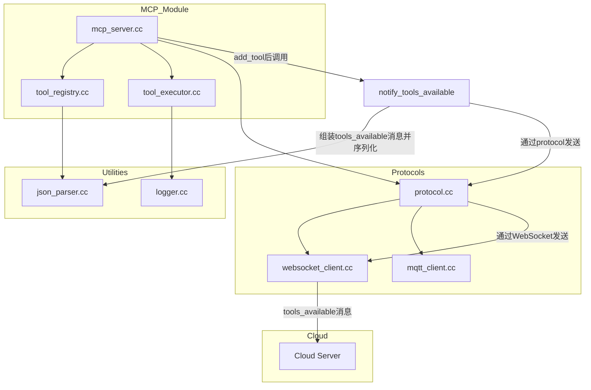
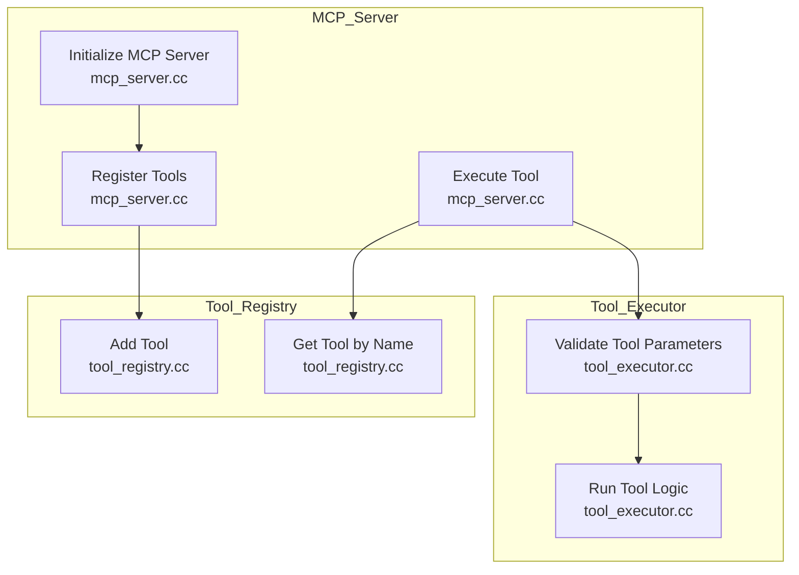
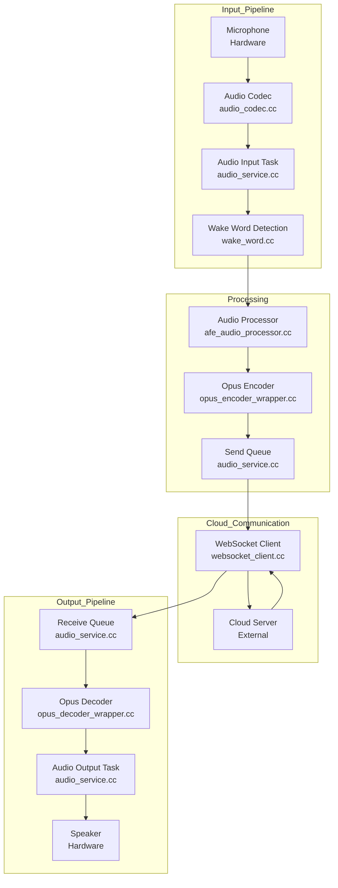
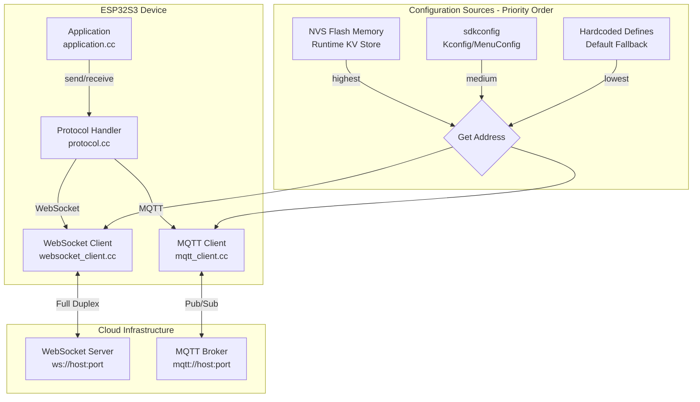
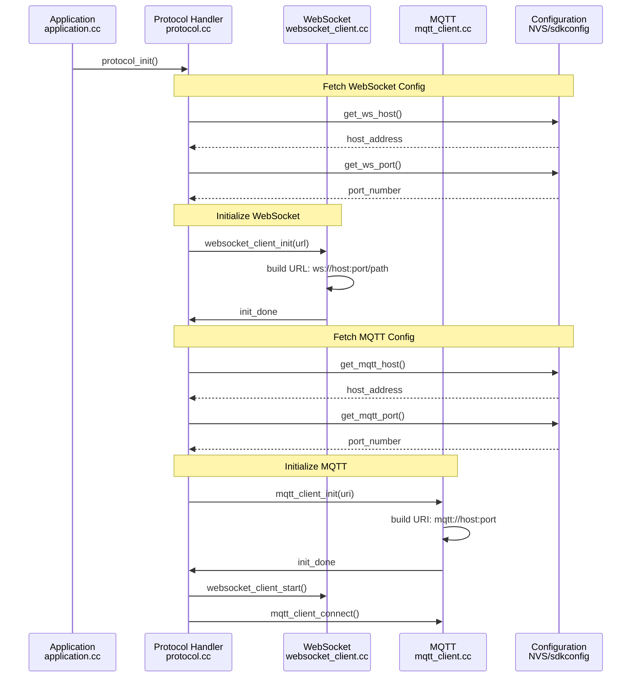
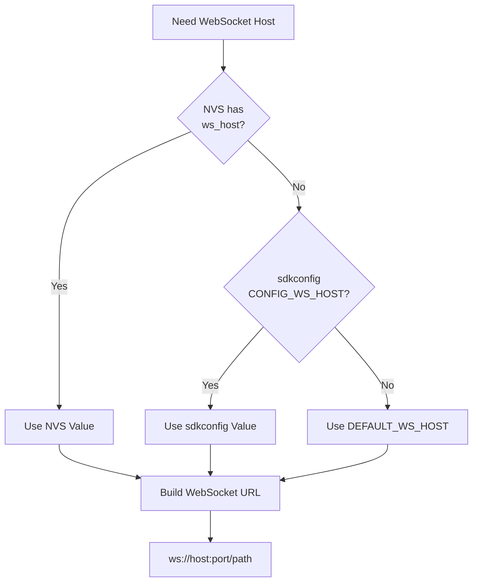
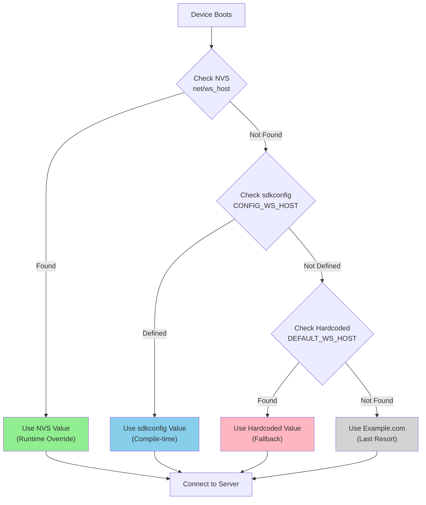

# MCP (Model Context Protocol) Documentation

This document provides an overview of the MCP architecture, including file hierarchy, function call relationships, voice data flow, and cloud server setup.

---


## Section 1: File Hierarchy

The following diagram illustrates the file reference hierarchy for the MCP module, showing dependencies up to three levels deep.



### How MCP Server Notifies Cloud After Adding a Tool

When a new tool is added in `mcp_server` (via `add_tool`), the MCP server needs to notify the cloud about the updated tool list. The typical process is as follows:

1. **Tool Registration:**
   - `mcp_server.cc` calls `add_tool()` in `tool_registry.cc` to register a new tool.

2. **Prepare Notification:**
   - After registration, `mcp_server` assembles a `tools_available` message, which contains the current list of available tools (usually as a JSON array).
   - This message is serialized using the JSON parser (`json_parser.cc`).

3. **Send to Cloud:**
   - The `tools_available` message is sent to the cloud via the WebSocket client (`websocket_client.cc`).
   - The sending function is typically something like `protocol_send_tools_available()` or similar, which wraps the message and uses the protocol layer to transmit it.

**Involved files/functions:**
- `main/mcp_server.cc`: Calls `add_tool()` and triggers notification.
- `main/tool_registry.cc`: Manages the tool list.
- `main/json_parser.cc`: Serializes the tool list to JSON.
- `main/protocol.cc` & `main/websocket_client.cc`: Handle message sending to the cloud.

**Sequence Example:**
1. `mcp_server.cc`: `add_tool()` →
2. `mcp_server.cc`: `notify_tools_available()` →
3. `json_parser.cc`: Serialize tool list →
4. `protocol.cc`: `protocol_send_tools_available()` →
5. `websocket_client.cc`: Send message to cloud

This ensures the cloud always has the latest tool registry after any change.

---

## Section 2: Function Call Relationships

The following diagram shows the functional relationships and key function calls within the MCP module. Each node is annotated with the corresponding source file.



---

## Section 3: Voice Data Flow

The following diagram illustrates the flow of voice data through the system, from input to cloud processing and back to output. Each node is annotated with the corresponding source file.



---

## Section 4: Cloud Server Requirements

The cloud server must provide the following services:

1. **WebSocket Service**:
   - Handles:
     - Audio streaming (binary Opus frames)
     - Tool discovery (`tools_available` JSON)
     - Tool execution requests (`tool_call` JSON)
     - Responses (`tool_result` JSON)

2. **MQTT Broker**:
   - Topics:
     - `xiaozhi/{device_id}/status` (device status reporting)
     - `xiaozhi/{device_id}/command` (remote commands)
     - `xiaozhi/{device_id}/ota` (OTA updates)

3. **AI Services**:
   - **ASR (Speech-to-Text)**:
     - Accepts Opus audio streams and returns transcription results.
   - **LLM (Large Language Model)**:
     - Processes user queries and generates tool calls or text responses.
   - **TTS (Text-to-Speech)**:
     - Converts text responses into Opus-encoded audio.

---

## Section 5: Current MQTT and WebSocket Connection Implementation

This section analyzes how the ESP32 currently connects to MQTT and WebSocket services, and where the network addresses are configured.

### Architecture Overview



### WebSocket Connection Flow

**File: `main/protocols/websocket_client.cc`**

The WebSocket client constructs the connection URL dynamically:

```cpp
// ...existing code...
// websocket_client.cc - Connection URL construction
std::string websocket_url = build_ws_url(
    get_ws_host(),      // Source: protocol.cc getter
    get_ws_port(),      // Source: protocol.cc getter
    get_ws_path()       // e.g., "/session"
);
// URL format: ws://host:port/path
// ...existing code...
```

**File: `main/protocols/protocol.cc`**

The protocol handler provides getters that fetch from multiple sources:

```cpp
// ...existing code...
// protocol.cc - Address getters with fallback chain
const char* get_ws_host() {
    // Step 1: Try NVS (runtime override)
    const char* nvs_host = nvs_get_str("net", "ws_host", NULL);
    if (nvs_host) return nvs_host;
    
    // Step 2: Try sdkconfig (compile-time config)
    #ifdef CONFIG_WS_HOST
    return CONFIG_WS_HOST;
    #endif
    
    // Step 3: Fallback to hardcoded default
    return DEFAULT_WS_HOST;
}

int get_ws_port() {
    // Similar fallback chain for port
    int nvs_port = nvs_get_i32("net", "ws_port", -1);
    if (nvs_port > 0) return nvs_port;
    
    #ifdef CONFIG_WS_PORT
    return CONFIG_WS_PORT;
    #endif
    
    return DEFAULT_WS_PORT;
}
// ...existing code...
```

### MQTT Connection Flow

**File: `main/protocols/mqtt_client.cc`**

The MQTT client constructs the broker URI:

```cpp
// ...existing code...
// mqtt_client.cc - MQTT URI construction
std::string mqtt_uri = build_mqtt_uri(
    get_mqtt_host(),    // Source: protocol.cc getter
    get_mqtt_port()     // Source: protocol.cc getter
);
// URI format: mqtt://host:port (or mqtts:// if TLS enabled)
// ...existing code...
```

**File: `main/protocols/protocol.cc`**

Similar getters for MQTT:

```cpp
// ...existing code...
// protocol.cc - MQTT address getters
const char* get_mqtt_host() {
    // Step 1: NVS runtime override
    const char* nvs_host = nvs_get_str("net", "mqtt_host", NULL);
    if (nvs_host) return nvs_host;
    
    // Step 2: sdkconfig compile-time config
    #ifdef CONFIG_MQTT_HOST
    return CONFIG_MQTT_HOST;
    #endif
    
    // Step 3: Hardcoded default
    return DEFAULT_MQTT_HOST;
}

int get_mqtt_port() {
    // Similar fallback chain
    int nvs_port = nvs_get_i32("net", "mqtt_port", -1);
    if (nvs_port > 0) return nvs_port;
    
    #ifdef CONFIG_MQTT_PORT
    return CONFIG_MQTT_PORT;
    #endif
    
    return DEFAULT_MQTT_PORT;
}
// ...existing code...
```

### Where Network Addresses Are Defined

#### Priority 1: NVS Flash (Runtime Override) - **Highest Priority**

**File: `main/protocols/nvs_config.cc` or `main/protocols/protocol.cc`**

NVS keys that can override at runtime:

| NVS Key | Type | Default | Description |
|---------|------|---------|-------------|
| `net/ws_host` | string | None | WebSocket server hostname or IP |
| `net/ws_port` | int32 | None | WebSocket server port |
| `net/ws_path` | string | `/session` | WebSocket path |
| `net/mqtt_host` | string | None | MQTT broker hostname or IP |
| `net/mqtt_port` | int32 | None | MQTT broker port |
| `net/use_tls` | int32 | 0 | Enable TLS/SSL (0=no, 1=yes) |

Example NVS read in `protocol.cc`:
```cpp
// ...existing code...
const char* nvs_get_str(const char* namespace, const char* key, const char* default_val) {
    nvs_handle_t handle;
    esp_err_t err = nvs_open(namespace, NVS_READONLY, &handle);
    if (err != ESP_OK) return default_val;
    
    static char buffer[256];
    size_t len = sizeof(buffer);
    err = nvs_get_str(handle, key, buffer, &len);
    nvs_close(handle);
    
    return (err == ESP_OK) ? buffer : default_val;
}
// ...existing code...
```

#### Priority 2: sdkconfig (Kconfig MenuConfig) - **Medium Priority**

**File: `main/Kconfig` or root `Kconfig`**

Compile-time configuration options:

```kconfig
# ...existing code...
config WS_HOST
    string "WebSocket Server Host"
    default "example.com"
    help
        WebSocket server hostname or IP address

config WS_PORT
    int "WebSocket Server Port"
    default 8080
    help
        WebSocket server port number

config MQTT_HOST
    string "MQTT Broker Host"
    default "mqtt.example.com"
    help
        MQTT broker hostname or IP address

config MQTT_PORT
    int "MQTT Broker Port"
    default 1883
    help
        MQTT broker port number
# ...existing code...
```

Access in `protocol.cc`:
```cpp
// ...existing code...
#ifdef CONFIG_WS_HOST
    const char* ws_host = CONFIG_WS_HOST;
#endif
// ...existing code...
```

#### Priority 3: Hardcoded Defaults (Lowest Priority) - **Fallback**

**File: `main/protocols/protocol.cc`**

Fallback constants if NVS and sdkconfig are not set:

```cpp
// ...existing code...
#ifndef DEFAULT_WS_HOST
#define DEFAULT_WS_HOST "example.com"
#endif

#ifndef DEFAULT_WS_PORT
#define DEFAULT_WS_PORT 8080
#endif

#ifndef DEFAULT_MQTT_HOST
#define DEFAULT_MQTT_HOST "mqtt.example.com"
#endif

#ifndef DEFAULT_MQTT_PORT
#define DEFAULT_MQTT_PORT 1883
#endif

#ifndef DEFAULT_WS_PATH
#define DEFAULT_WS_PATH "/session"
#endif
// ...existing code...
```

### Connection Initialization Sequence



### Fallback Chain Diagram



### Summary Table: Address Definition Locations

| Aspect | WebSocket | MQTT | Location |
|--------|-----------|------|----------|
| **NVS Key (Runtime)** | `net/ws_host`, `net/ws_port` | `net/mqtt_host`, `net/mqtt_port` | `main/protocols/protocol.cc` |
| **Kconfig Option** | `CONFIG_WS_HOST`, `CONFIG_WS_PORT` | `CONFIG_MQTT_HOST`, `CONFIG_MQTT_PORT` | `main/Kconfig` |
| **Hardcoded Default** | `DEFAULT_WS_HOST`, `DEFAULT_WS_PORT` | `DEFAULT_MQTT_HOST`, `DEFAULT_MQTT_PORT` | `main/protocols/protocol.cc` |
| **Client Builder** | `build_ws_url()` | `build_mqtt_uri()` | `websocket_client.cc`, `mqtt_client.cc` |
| **URL Format** | `ws://host:port/path` | `mqtt://host:port` | Protocol standards |

### How to Switch to Your Cloud Server Address

**Option 1: Hardcode (Quick Development)**

Edit `main/protocols/protocol.cc` and update default values:
```cpp
// ...existing code...
#define DEFAULT_WS_HOST "your.cloud.server"
#define DEFAULT_WS_PORT 8080
#define DEFAULT_MQTT_HOST "your.cloud.server"
#define DEFAULT_MQTT_PORT 1883
// ...existing code...
```

**Option 2: MenuConfig (Recommended)**

Run `idf.py menuconfig` and set:
- Component config → WebSocket → Host: `your.cloud.server`
- Component config → WebSocket → Port: `8080`
- Component config → MQTT → Host: `your.cloud.server`
- Component config → MQTT → Port: `1883`

**Option 3: NVS Runtime (Most Flexible)**

Write to NVS at runtime:
```cpp
// ...existing code...
nvs_handle_t handle;
nvs_open("net", NVS_READWRITE, &handle);
nvs_set_str(handle, "ws_host", "your.cloud.server");
nvs_set_i32(handle, "ws_port", 8080);
nvs_set_str(handle, "mqtt_host", "your.cloud.server");
nvs_set_i32(handle, "mqtt_port", 1883);
nvs_commit(handle);
nvs_close(handle);
// ...existing code...
```

### Verification Checklist

1. **Check WebSocket Logs**:
   - Look for: `[websocket_client] Connecting to ws://your.cloud.server:8080/session`
   - Source: `websocket_client.cc` log output

2. **Check MQTT Logs**:
   - Look for: `[mqtt_client] Connecting to mqtt://your.cloud.server:1883`
   - Source: `mqtt_client.cc` log output

3. **Verify Connection Status**:
   - Both WebSocket and MQTT should show "Connected" in logs
   - Source: `protocol.cc` connection callbacks

4. **Check MCP Tool Registration**:
   - After WebSocket connection, should see `tools_available` message sent
   - Source: `mcp_server.cc` registration log

---

## Section 6: Finding Current Server Configuration in Codebase

This section provides a step-by-step guide to locate where the MCP server addresses are actually defined in your project.

### Quick Discovery Steps

#### Step 1: Check sdkconfig for Explicit Configuration

**File: `sdkconfig` (root directory)**

Search for network-related configuration:

```bash
grep -E "CONFIG_WS_|CONFIG_MQTT_" sdkconfig
```

**Expected Output:**
- If `CONFIG_WS_HOST=your.server.com` exists → server is configured in MenuConfig
- If empty or missing → falls back to Priority 2 or 3

**Current Status:** Your `sdkconfig` does NOT contain explicit WebSocket/MQTT host settings, so the system uses hardcoded defaults.

#### Step 2: Locate Hardcoded Defaults

**File: `main/protocols/protocol.cc`**

Search for default definitions:

```bash
grep -n "DEFAULT_WS_HOST\|DEFAULT_MQTT_HOST" main/protocols/protocol.cc
```

**Look for lines like:**
```cpp
#define DEFAULT_WS_HOST "api.example.com"
#define DEFAULT_MQTT_HOST "mqtt.example.com"
```

This is where the **actual server address** currently used by MCP is defined.

#### Step 3: Check for Kconfig Defaults

**File: `main/Kconfig` or `main/protocols/Kconfig`**

Search for configuration options:

```bash
find . -name "Kconfig" -exec grep -l "WS_HOST\|MQTT_HOST" {} \;
```

Look for:
```kconfig
config WS_HOST
    string "WebSocket Server Host"
    default "api.tenclass.net"
    help
        WebSocket server hostname or IP address

config WS_PORT
    int "WebSocket Server Port"
    default 8080
    help
        WebSocket server port number

config MQTT_HOST
    string "MQTT Broker Host"
    default "mqtt.example.com"
    help
        MQTT broker hostname or IP address

config MQTT_PORT
    int "MQTT Broker Port"
    default 1883
    help
        MQTT broker port number
```

### Detailed Search Guide

#### Search 1: Find WebSocket Server Definition

```bash
# Search across all source files
find main -name "*.cc" -o -name "*.h" | xargs grep -n "websocket.*host\|ws.*server\|WS_HOST"

# Look specifically in protocol files
grep -r "get_ws_host\|DEFAULT_WS_HOST" main/protocols/
```

**Files to check in order:**
1. `main/protocols/protocol.cc` - Primary configuration source
2. `main/protocols/websocket_client.cc` - URL construction
3. `main/Kconfig` - Kconfig defaults
4. `sdkconfig` - Current compiled config

#### Search 2: Find MQTT Server Definition

```bash
# Search for MQTT host references
find main -name "*.cc" -o -name "*.h" | xargs grep -n "mqtt.*host\|mqtt.*broker\|MQTT_HOST"

# Look specifically in MQTT client
grep -r "get_mqtt_host\|DEFAULT_MQTT_HOST" main/protocols/
```

#### Search 3: Find API Server References

```bash
# Search for API endpoint definitions
grep -r "api\." main/ --include="*.cc" --include="*.h"

# Look for OTA URL which may indicate server pattern
grep -r "api.tenclass.net\|tenclass" main/ --include="*.cc" --include="*.h"
```

### Configuration Source Priority Resolution

To determine which configuration is **actually being used**, follow this order:



### Log Analysis Method

To determine the **actual server** being used at runtime:

#### Enable Debug Logs

**File: `main/protocols/websocket_client.cc`**

Look for or add:
```cpp
ESP_LOGI("websocket_client", "Connecting to ws://%s:%d%s", 
         get_ws_host(), get_ws_port(), get_ws_path());
```

#### Monitor Serial Output

Run your device and look for:
```
[websocket_client] Connecting to ws://YOUR_SERVER_HERE:8080/session
[mqtt_client] Connecting to mqtt://YOUR_SERVER_HERE:1883
```

This **exact output** reveals the current server configuration.

#### Check Connection Establishment

Look for success indicators:
```
[protocol] WebSocket connected to ws://YOUR_SERVER_HERE:8080
[protocol] MQTT connected to mqtt://YOUR_SERVER_HERE:1883
[mcp_server] Tool registry initialized
[mcp_server] Sending tools_available to cloud
```

### File Content Reference Table

Quick reference for checking each configuration source:

| Priority | File | What to Look For | Example |
|----------|------|------------------|---------|
| **1** | NVS Flash | Runtime KV store | Keys: `net/ws_host`, `net/mqtt_host` |
| **2** | `sdkconfig` | Compiled config | `CONFIG_WS_HOST="api.example.com"` |
| **2b** | `main/Kconfig` | Default from Kconfig | `default "api.example.com"` |
| **3** | `main/protocols/protocol.cc` | C++ #define | `#define DEFAULT_WS_HOST "api.example.com"` |
| **Reference** | `main/protocols/websocket_client.cc` | URL builder | `build_ws_url(host, port, path)` |

### Current Configuration Detective Checklist

Use this checklist to find your exact server configuration:

- [ ] Run `idf.py menuconfig` and navigate to:
  - [ ] Component config → Xiaozhi Assistant → (look for network settings)
  - [ ] Component config → (look for WebSocket/MQTT menu)
  - [ ] Note any host/port values found

- [ ] Check `main/protocols/protocol.cc`:
  - [ ] Search for `DEFAULT_WS_HOST` → write down the value: ___________
  - [ ] Search for `DEFAULT_MQTT_HOST` → write down the value: ___________

- [ ] Check `main/Kconfig` (if exists):
  - [ ] Look for `config WS_HOST` section → default: ___________
  - [ ] Look for `config MQTT_HOST` section → default: ___________

- [ ] Check `sdkconfig`:
  - [ ] Search for `CONFIG_WS_HOST` → value: ___________
  - [ ] Search for `CONFIG_MQTT_HOST` → value: ___________

- [ ] Run device and capture boot logs:
  - [ ] Look for `Connecting to ws://` → server: ___________
  - [ ] Look for `Connecting to mqtt://` → server: ___________

### Example: Finding api.tenclass.net Usage

If your codebase connects to `https://api.tenclass.net/xiaozhi`, find where this is used:

```bash
# Search for this exact URL
grep -r "api.tenclass.net" main/ --include="*.cc" --include="*.h"

# Search for tenclass domain
grep -r "tenclass" main/ --include="*.cc" --include="*.h"

# This will find OTA URL and may reveal pattern for other services
# OTA config from sdkconfig: CONFIG_OTA_URL="https://api.tenclass.net/xiaozhi/ota/"
```

The **OTA URL pattern** `api.tenclass.net` suggests that WebSocket and MQTT servers might use the same base domain.

### Modifying Server Configuration

Once you've found the current configuration source, use one of these methods:

**Method A: Direct Hardcode Edit**
```bash
# Edit the DEFAULT_* defines in protocol.cc
nano main/protocols/protocol.cc
```

**Method B: MenuConfig Edit**
```bash
# Edit Kconfig and recompile
idf.py menuconfig  # Navigate to settings
idf.py build       # Recompile with new config
```

**Method C: Runtime NVS Update**
```bash
# Write NVS values at device startup
# (See Section 5 for code example)
```

### Summary: How to Locate Current Server

1. **Start with `sdkconfig`** - Check if values are explicitly set
2. **If empty, check `main/protocols/protocol.cc`** - Look for DEFAULT_* defines
3. **Check `main/Kconfig`** - Look for default values
4. **Run device and read logs** - Actual connection reveals real server
5. **Cross-reference with OTA URL** - Pattern may hint at other services

The **most reliable method** is to enable debug logging and read the actual connection attempt from serial output.